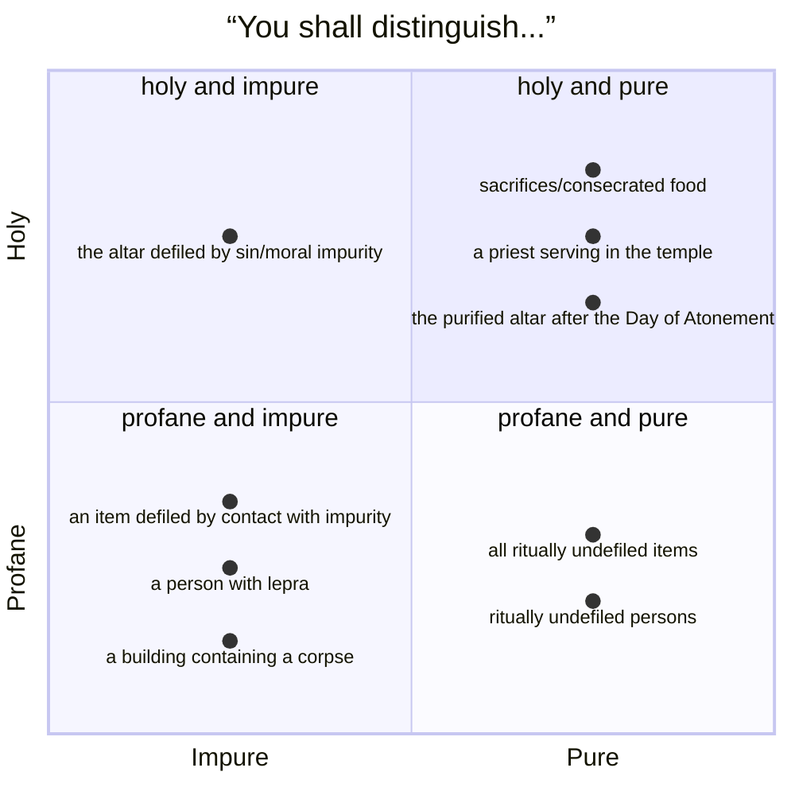
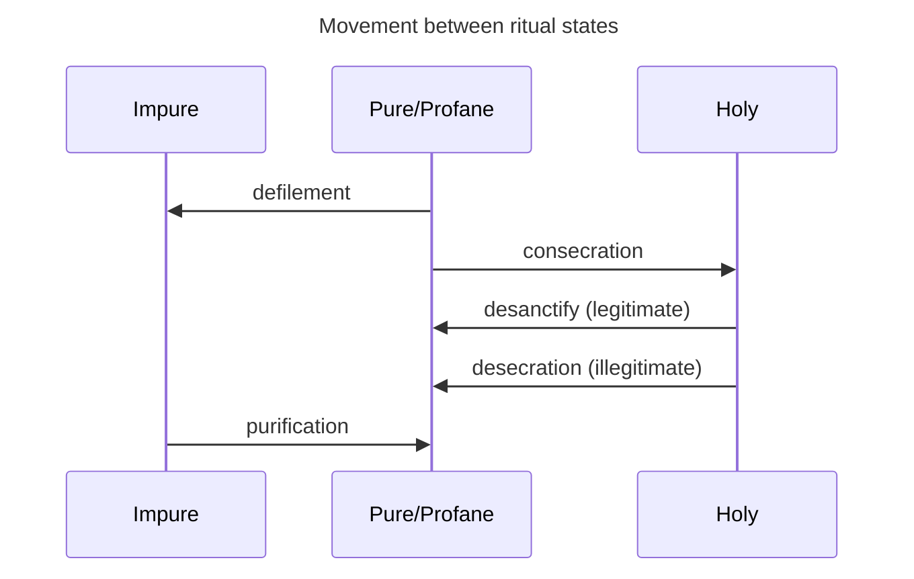

# Jesus and the Law of Israel 

## Session 3: Purity and Presence

<!-- Background image can be found here: https://en.wikipedia.org/wiki/File:Benjamin_West_-_Joshua_passing_the_River_Jordan_with_the_Ark_of_the_Covenant_-_Google_Art_Project.jpg -->

---
layout: quote
---

# Leviticus 10:8--11
“And the <sc>Lord</sc> spoke to Aaron saying... ‘You shall distinguish between the holy and the profane, and between the impure and the pure, and you shall teach the people of Israel all the statutes that the <sc>Lord</sc> spoke to them through Moses.’”

# Leviticus 15:31
“\[The <sc>Lord</sc> spoke to Moses and Aaron, saying,\] ‘Thus shall you keep the people of Israel separate from their impurity, lest they die in their impurity by defiling my tabernacle that is in their midst.’”

<!--
* Lev 10 describes a fundamental duty of the priests: to distinguish and to teach.
* The priests are responsible for maintaining boundaries around the presence of the Lord and around the people and the land.
    * This involves separating the holy and profane and the pure and the impure.
    * Many English translations use the terms "clean"/"unclean" which obscures what's actually going on. 
        * The issue isn't cleanliness, but impurity.
        * This is a metaphysical contagion that goes beyond the presence or absence of dirt or other physical contaminants.
* The significance of purity law is not a a matter of cleanliness or of simple piety.
* Rather, the continued cohabitation of God with the nation is at stake.
* The defiling of the tabernacle threatens the integrity of the Sinai covenant.
-->

---
layout: quote
---

# Ezekiel 22:26 
“\[The land’s\] priests have done violence to my instruction and have profaned my holy things; they have not distinguished between the holy and the profane, and they have not taught the difference between the impure and the pure, and they have disregarded my sabbaths, so that I am profaned in their midst.”

# Ezekiel 44:23
“And \[the priests\] shall teach my people to know the difference between the holy and the profane, and the difference between the impure and the pure.”

<!--
* This priestly duty comes up in Ezekiel 22:26 and Ezekiel 44:23.
* Ezekiel 22 describes the failure of the priests to properly teach/distinguish; this leads to the profanation of God himself.
* Ezekiel 44 describes a vision of a renewed temple where the priests carry out their duty appropriately.
-->

---
layout: chart
---

---
layout: default
---

Adapted from Jacob Milgrom, “The Dynamics of Purity in the Priestly System,” in *Purity and Holiness: The Heritage of Leviticus*, ed. Marcel Poorthuis and Joshua J. Schwartz, 30.

---
layout: section
---

# ritual impurity

<!--
* Violations of the boundaries between holy/profane and impure/pure are described using the language of "defilement."
* This language occurs in different contexts and describes different actions and states.
* When we survey these different contexts, we find that there are two types of impurity that Leviticus descibes: ritual impurity and moral impurity.
-->

---
layout: quote
---

# Leviticus 12:2--7 (NRSV)
“If a woman conceives and bears a male child, she shall be impure seven days; as at the time of her menstruation, she shall be impure\.\.\.\. Her time of blood purification shall be thirty-three days; she shall not touch any holy thing, or come into the sanctuary, until the days of her purification are completed\.\.\.\. When the days of her purification are completed... she shall bring to the priest at the entrance of the tent of meeting a lamb in its first year for a burnt offering, and a pigeon or a turtledove for a \[purification\] offering. He shall offer it before the <sc>Lord</sc>, and \[effect expiation/purgation\] on her behalf; then she shall be purified from her flow of blood.”

<!--
* Note that no sin is involved here. A possible misperception here is that ritual impurity is sinful and so the process of pregnancy and childbirth is somehow related to sin.
    * Rather, the point is maintaining the boundary between holy space and impurity.
* Why does childbirth warrant this purification?
    * There isn't a clear explanation for this, but we can discern a pattern, i.e., many of the circumstances requiring purification are related to life and death. Loss of blood or seminal fluid clearly relates to forces of life and death, for example.
-->

---
layout: quote
---

# Leviticus 15:2--15
“When any man has a discharge from his member, his discharge makes him impure\.\.\.\. Every bed on which the one with the discharge lies shall be impure; and everything on which he sits shall be impure. Anyone who \[touches the man or various objects he has touched\] shall wash \[their\] clothes, and bathe in water, and be impure until the evening\.\.\.\. When the one with a discharge is cleansed of his discharge, he shall count seven days for his purification; he shall wash his clothes and bathe his body in fresh water, and he shall be purified. On the eighth day he shall take two turtledoves or two pigeons and come before the <sc>Lord</sc> to the entrance of the tent of meeting and give them to the priest. The priest shall offer them, one for a \[purification\] offering and the other for a burnt offering; and the priest shall \[effect expiation/purgation\] on his behalf before the <sc>Lord</sc> for his discharge.”

---
layout: quote
---

# Numbers 19:11--15
“Those who touch the dead body of any human being shall be impure seven days. They shall purify themselves with \[the water of purification\] on the third day and on the seventh day, and so be pure; but if they do not purify themselves on the third day and on the seventh day, they will not become pure. All who touch a corpse, the body of a human being who has died, and do not purify themselves, defile the tabernacle of the <sc>Lord</sc>; such persons shall be cut off from Israel. Since water for purification was not dashed on them, they remain impure; their impurity is still on them. This is the law when someone dies in a tent: everyone who comes into the tent, and everyone who is in the tent, shall be impure seven days. And every open vessel with no cover fastened on it is impure.”

---
layout: section
---

# moral impurity

---
layout: quote
---

# Leviticus 18:26--28
“But you shall keep my statutes and my ordinances and commit none of these \[sexual\] abominations... otherwise the land will vomit you out for defiling it, as it vomited out the nation that was before you.”

# Leviticus 20:3
“I myself will set my face against \[the one who worships Molech\], and will cut them off from the people, because they have given of their offspring to Molech, defiling my sanctuary and profaning my holy name.”

# Numbers 35:33--34
“You shall not pollute the land in which you live; for blood pollutes the land, and no \[expiation/purgation\] can be made for the land... except by the blood of the one who shed it. You shall not defile the land in which you live, in which I also dwell; for I the <sc>Lord</sc> dwell among the Israelites.”

<!--
* Moral impurity differs from ritual impurity.
    * Moral impurity results from serious sin, especially sexual sin, idolatry, or violence.
    * This impurity lacks the contagious nature of ritual impurity. Rather, moral impurity pollutes the land and sanctuary.
    * This impurity cannot be removed by the usual purification methods used to address ritual impurity. You have to keep from committing these serious sins in the first place or accept the punishment/atonement that the law prescribes.
    * Although the language of purity and defilement are used to describe moral impurity, the terms "pollution" and "abomination" largely pertain only to moral impurity.
* How does sin defile?
    * Much like ritual impurity, it's not clear exactly how sin defiles. The exact mechanics of how sin defiles the altar/sanctuary/land isn't made explicit in biblical law.
    * Various ideas about the defiling nature of sin crop up in early Jewish literature, but biblical law itself does not explain this.
* This has significant implications for the life of the nation.
    * Sin degrades the one who commits it and brings the pollution of moral impurity to the individual, the land, and the sanctuary.
    * God warns that if the lang reaches a sufficient level of moral pollution, he will remove the source of impurity, i.e., Israel.
    * Non-Israelite lands are already thought of as polluted with moral impurity, so the goal is to keep Israel from becoming like the profane nations; Israel must be holy.
-->

---
layout: default
---

# Ritual impurity
1. Unavoidable, sometimes natural, and part of everyday life.
2. Can be contracted from objects or substances.
3. Can be transmitted to others directly and indirectly.
4. Removed by time, ritual washing, and sometimes sacrifice.
5. ***Not*** sinful! It is not a sin to become ritually impure.

 

# Moral impurity
1. Avoidable.
2. Caused by grave sin, but cannot be spread through social contagion.
3. Pollutes the land of Israel.
4. Typically can be removed via atonement or punishment, but sometimes irremovable.
5. ***Absolutely*** sinful.

<!--
* These laws are not metaphors for the Israelites.
    * These laws are about living in such a way that God's holy nation is continuously aware of their calling.
        * Notably, if someone doesn't follow the laws regarding ritual purity, they violate God's commands and run the risk of incurring moral impurity. These two systems are related.
    * Furthermore, these laws make God's continued presence among his people and the presence of the people in the land possible.
-->

---
layout: quote
---

# Deuteronomy 30:11--15
“Surely, this commandment that I am commanding you today is not too hard for you, nor is it too far away. It is not in heaven, that you should say, ‘Who will go up to heaven for us, and get it for us so that we may hear it and observe it?’ ... No, the word is very near to you; it is in your mouth and in your heart for you to observe. See, I have set before you today life and \[good\], death and \[evil\].”

<!--
* Is Israel actually supposed to be able to keep all these purification laws? Absolutely yes.
* It's common to hear that biblical law is purposefully extensive and obtuse so that Israel would not be able to keep it all and therefore be forced to rely on God's mercy.
    * There's some merit to the idea that Israel needed to rely on God's grace and mercy.
    * Still, God gives this law ***to be kept***. It makes no sense to say that obedience to biblical law is an impossible task that is, Tantalus-like, always out of Israel's grasp.
    * Will Israel fail? Certainly. But this isn't due to the impossibility of obedience but rather the ensnaring power of human sin.
-->
---
layout: quote
---

# Jacob Milgrom
“Biblical impurity and holiness... are semantic opposites and as the quintessence and source of *qedusha* resides with God, it is imperative for Israel to control the occurrence of impurity lest it impinge on the realm of the holy God. The forces pitted against each other in the cosmic struggle are no longer the benevolent and demonic deities that populate the mythologies of Israel’s neighbors but ***the forces of life and death*** set loose by humans themselves through their obedience to or defiance of God’s commandments.”

# Matthew Thiessen
“Proper maintenance, ***not transformation***, of the current conditions of the world was \[the priests’\] sole, divinely ordained goal\.\.\.\. The Jesus of the Gospels is the holy one of God, a man who embodies a contagious power or force that is opposed to and ultimately destroys the powers that create impurity and death.”

<!--
See Jacob Milgrom, “The Dynamics of Purity in the Priestly System,” in *Purity and Holiness: The Heritage of Leviticus*, ed. Marcel Poorthuis and Joshua J. Schwartz, Jewish and Christian Perspectives Series 2 (Leiden: Brill, 2000), 32 and Matthew Thiessen, *Jesus and the Forces of Death: The Gospels’ Portrayal of Ritual Impurity within First-Century Judaism* (Grand Rapids, Mich.: Baker Academic, 2021), 19--20.

* This binary of impurity and holiness calls to mind the words of Moses
* Notably, the priests are not out to rid the world of impurity.
    * Rather, they are Israel's janitors, tasked with enabling the people to remove their impurity and teaching them how to keep covenant with God.
-->

---
layout: qr-code
url: https://andrewhwaller.github.io/slidev-template
---
# QR code for this presentation
---

