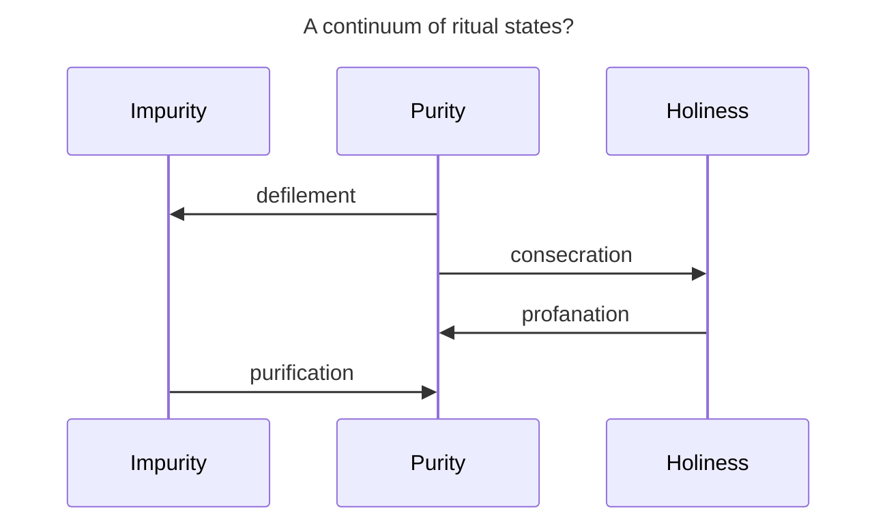

# Jesus and the Law of Israel 

## Session 3: Purity and Presence

<!-- Background image can be found here: https://en.wikipedia.org/wiki/File:Benjamin_West_-_Joshua_passing_the_River_Jordan_with_the_Ark_of_the_Covenant_-_Google_Art_Project.jpg -->

---
layout: quote
---

# Leviticus 10:8--11
“And the <sc>Lord</sc> spoke to Aaron saying... ‘You shall distinguish between the holy and the profane, and between the impure and the pure, and you shall teach the people of Israel all the statutes that the <sc>Lord</sc> spoke to them through Moses.’”

<!--
* Lev 10 describes a fundamental duty of the priests: to distinguish and to teach.
* The priests are responsible for maintaining boundaries around the presence of the Lord and around the people and the land.
    * This involves separating the holy and profane and the pure and the impure.
    * Many English translations use the terms "clean"/"unclean" which sort of masks what's actually going on. 
        * The issue isn't cleanliness, but impurity.
        * This is a metaphysical contagion that goes beyond the presence or absence of dirt or other physical contaminants.
-->
---
layout: quote
---

# Ezekiel 22:26 
“\[The land's\] priests have done violence to my instruction and have profaned my holy things; they have not distinguished between the holy and the profane, and they have not taught the difference between the impure and the pure, and they have disregarded my sabbaths, so that I am profaned in their midst.”

# Ezekiel 44:23
“And \[the priests\] shall teach my people the difference between the holy from the profane, and to know the difference between the impure and the pure.”

---
layout: chart
---

---
layout: chart
---

<!--
* Is there an impurity-holiness continuum?
* Jay Sklar portrays ritual status in this way, although the words "continuum" or "spectrum" are not used.
* In this schema, consecration moves the subject from purity to holiness, while profanation does the opposite.
* Likewise, defilement and purification allow movement between purity and impurity.
* The issue here is that this framing does not account for the possibility of the defilement of a holy item.
    * To wit, the altar does not cease to be holy when it is defiled by moral impurity.
    * Likewise, a priest does not cease to be holy when he is defiled by bodily impurity.
    * Indeed, it is the continued holiness of the subject that demands elimination of impurity.
* It seems better to understand holiness as a divinely-ordained state that persists even if the subject undergoes defilement.
-->
---
layout: qr-code
url: https://andrewhwaller.github.io/slidev-template
---
# QR code for this presentation
---
